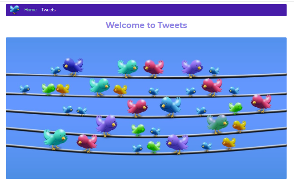
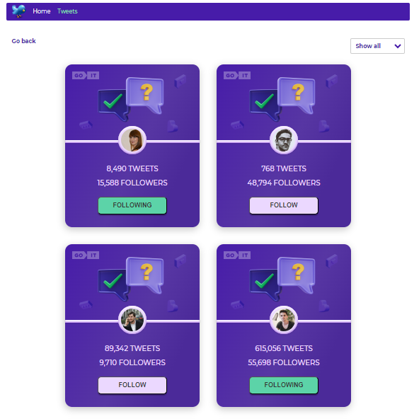

## User Tweet Cards Project

This React project showcases a user tweet card application with interactive
features. Users can subscribe and unsubscribe from following other user's
tweets. The project includes two pages: Home and Tweets.

### Home Page

The Home page displays a warm greeting and serves as the entry point to the
application. 

### Tweets Page

The Tweets page presents the user's tweets and provides the following
functionality:

- Interactive buttons to subscribe and unsubscribe from a user's tweet updates.
- The ability to filter tweets based on the subscription status.
- A Back button that allows users to navigate back to the Home page.
  

### Installation

1. Clone the repository: `git clone <repository-url>`
2. Navigate to the project directory: `cd user-tweet-cards`
3. Install the dependencies: `npm install`

### Usage

1. Start the development server: `npm start`
2. Open your browser and visit `http://localhost:3000` to access the
   application.

Feel free to explore the different features and interact with the user tweet
cards!

### Technologies Used

- React
- JS
- HTML
- CSS

### Credits

This project was developed as part of a React application showcase. It
demonstrates frontend development skills and the implementation of interactive
features.

For more information, please refer to the source code.
